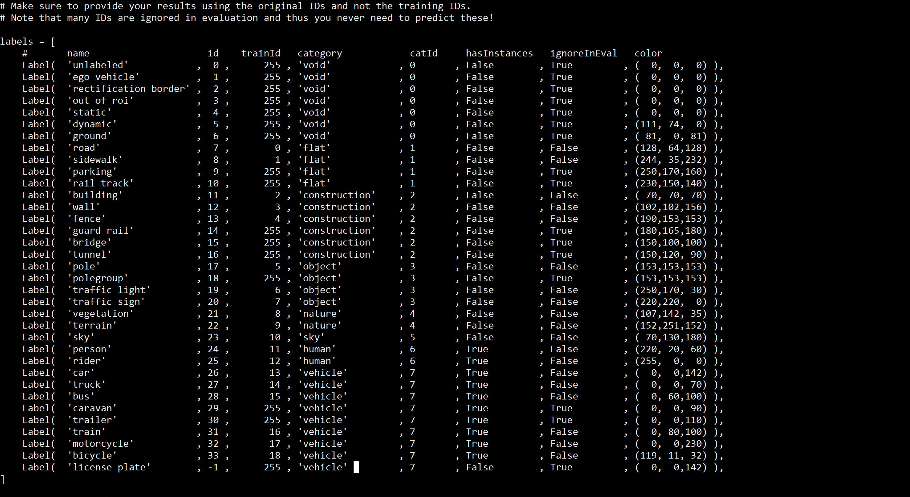

# HRNet-Semantic-Segmentation-HRNet

这个工程记录我自己跑通的一些代码，并介绍怎么在自己电脑上运行。


原HRNet代码可以在[这里](https://github.com/HRNet/HRNet-Semantic-Segmentation)找到


  
## 环境

* 建议使用python3.8
```
conda create --name HRNet python=3.8.18
```
* 我自己用的torch版本
```bash
conda install pytorch==1.11.0 torchvision==0.12.0 torchaudio==0.11.0 cudatoolkit=11.3 -c pytorch
```
* 其他需要的库
```bash
pip install -r requirements.txt
```

## 需要下载的内容

预训练权重在[这里](https://github.com/hsfzxjy/models.storage/releases/download/HRNet-OCR/hrnet_ocr_cs_8162_torch11.pth)下载
(权重需要放在`./pretrained_models`文件夹里面）

夜间语义分割标签来自于[这个](https://github.com/XiaRho/CMDA)工程
[下载V1版本](https://drive.google.com/file/d/1LWinkZXUWKBzl946wxhLKaHbOOIP-hRi/view?usp=sharing)
[下载V2版本](https://drive.google.com/file/d/1BgYqQj97TBNJuqVnrbQcfKL3jjwQp5h2/view?usp=sharing)

其余语义分割标签需要在[官网](https://dsec.ifi.uzh.ch/dsec-detection/)下载：

## 运行前的准备
* Ids格式标签放data/cityscapes/gtFine里面，重建图片放data/cityscapes/leftImg8bit里面。
* 如果你不确定自己的标签是不是Ids格式，可以使用`xjh_count.py`检查标签图像的像素值。TrainIds和Ids对应关系如下：
  
* 如果你的标签不是Ids格式，而是TrainIds格式，那么可以使用`train2ids.py`进行转换。


## 运行
一、如果已经按照上面的操作，将图片放入对应的文件夹，并且确定标签格式正确，则开始运行：
```bash
python xjh_setup.py
```
这一步是为了创建存放了对应关系的`./data/val.txt`
代码逻辑为：读取所有标签，然后寻找同名的图片。因此：
1、请修改图片名，使得对应的图片名字相同。
2、重建图片数量可以比标签多。

二、开始进行语义分割
```bash
python tools/test.py --cfg experiments/cityscapes/seg_hrnet_ocr_w48_train_512x1024_sgd_lr1e-2_wd5e-4_bs_12_epoch484.yaml TEST.MODEL_FILE pretrained_models/hrnet_ocr_cs_8162_torch11.pth TEST.SCALE_LIST 0.5,1.0, TEST.FLIP_TEST True
```
分割结果保存在`./test_results`里。
